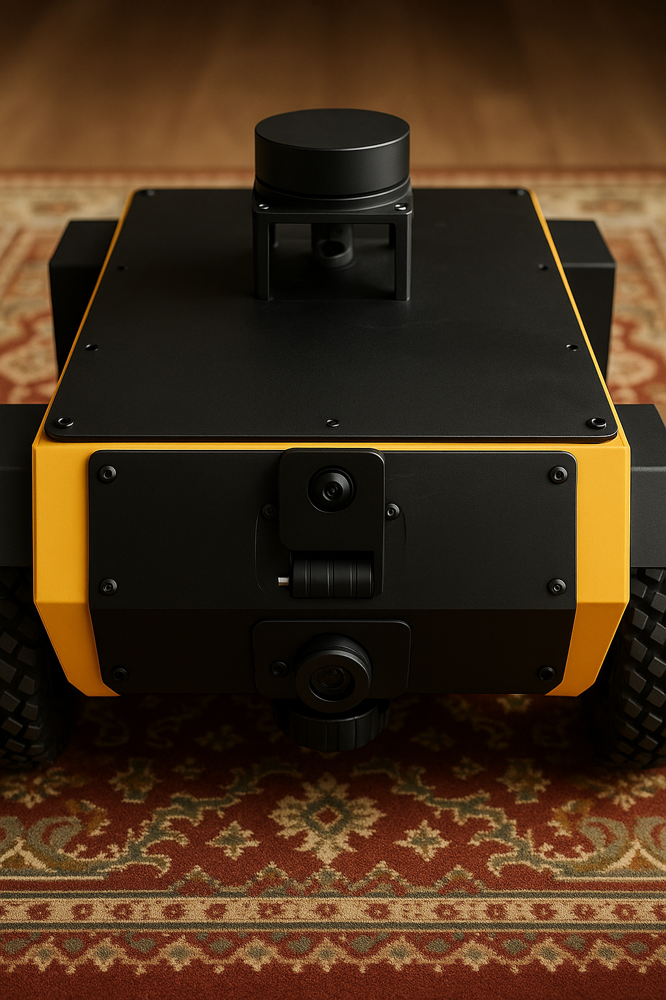
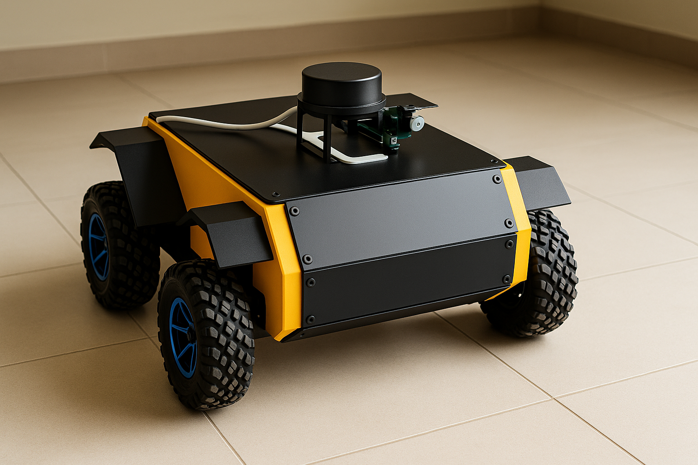
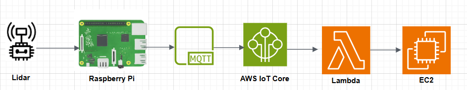
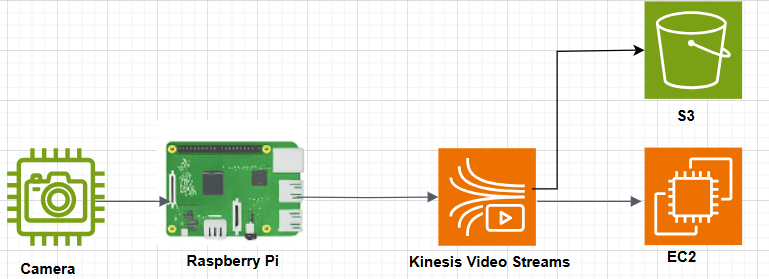
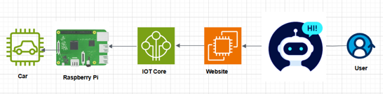

# 🤖 Smart AI-Controlled Vehicle 🚀

An innovative self-driving vehicle powered by a conversational AI agent (Gemini), delivering **real-time LiDAR mapping**, **live video streaming**, and fully integrated with **AWS cloud services** for seamless control, monitoring, and data processing.
Built as a graduation project to demonstrate the synergy of **AI, IoT, Edge Computing, and Cloud**, all working together to enable the future of autonomous smart systems.

---

## 🧠 Features

- 🧠 **AI Agent (Gemini API)**: Users can chat with an AI assistant to send commands to the car.
- 🚗 **Smart Car Control**: The AI or manual dashboard can control the Raspberry Pi-powered vehicle.
- 📡 **Real-Time LiDAR Data**: Visualized on the web via Flask and Socket.IO.
- 🎥 **Live Video Streaming**: From the car using AWS Kinesis Video Streams.
- ☁️ **Cloud Integration**: With AWS IoT Core, Lambda, S3, and EC2.

---
## 🎥 Demo Video

▶️ [Watch the demo on Google Drive](https://drive.google.com/file/d/1SHh_RnhwLcLA-9IFzbde7YEOXkfiMY_3/view?usp=sharing)

---

## 🚗 Prototype Photos
|                    Front View                       |                  Top View                        |
|-----------------------------------------------------|--------------------------------------------------|
|  |  |
---

## 🧭 System Architecture

---

## 🔄 Data Flows

### 📡 LiDAR Data Flow

### 🎥 Camera Stream Flow

### 🤖 AI Agent Flow

